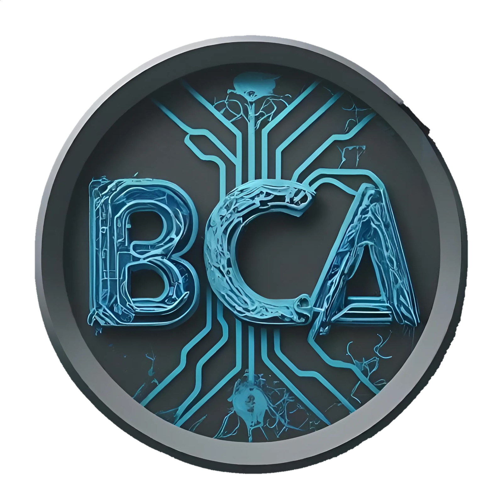

# BCAHub

### Your Ultimate BCA Study Hub

**For Students, By Students.**

A free educational platform that brings together semester-wise BCA study resources, student tools, and academic content in one place.

[🌐 Live Website](https://pixels111.github.io/bcahub/) •
[📚 Resources](https://pixels111.github.io/bcahub/resources/) •
[🌌 Content Galaxy](https://pixels111.github.io/bcahub/content/) •
[📖 About](https://pixels111.github.io/bcahub/about/) •
[❓ Help](https://pixels111.github.io/bcahub/help/) •
[📩 Contact](https://pixels111.github.io/bcahub/contact/)

---

# Project Overview

BCAHub is a free academic platform developed to help **Bachelor of Computer Applications (BCA)** students access study materials quickly and efficiently.

Instead of searching across multiple websites and scattered Google Drive links, students can find everything in one organized platform. Resources are grouped semester-wise and category-wise, making it easier to locate the required material.

The platform focuses on providing a clean experience without mandatory registration or unnecessary distractions.

