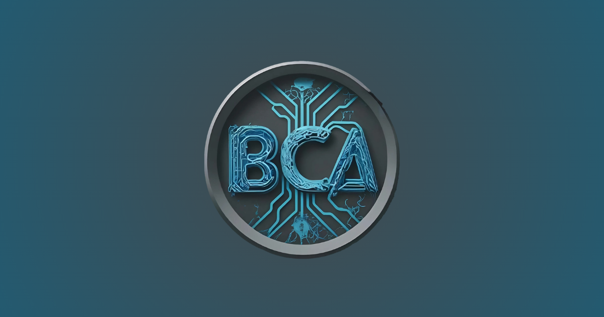
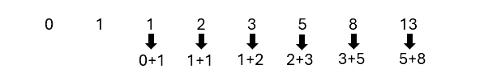

# 🎓 BCAHub

<p align="center">
  
</p>

<p align="center">
  <strong>Your Complete Companion for BCA Students</strong>
</p>

<p align="center">
  Resources • Articles • Forms • Guides • Notifications • Career Tools
</p>

---

## 📖 About

**BCAHub** is a modern educational platform designed for **Bachelor of Computer Applications (BCA)** students.

It provides learning resources, educational articles, useful forms, career guidance, website updates, and interactive tools through a clean and responsive interface.

The goal of BCAHub is to make important academic resources available from one place.

---

# 🌐 Live Website

**https://bcahub.netlify.app**

---

# 📷 Preview

## Home Page

<p align="center">

</p>

---

## Features

### 📚 Educational Articles

- Programming Tutorials
- Career Guides
- Technical Articles
- Computer Science Topics

---

### 📥 Resources

- Notes
- Study Material
- Download Links
- Reference Content

---

### 📝 Forms

Interactive forms including

- Feedback Form
- Contact Form
- Suggestions
- User Requests

---

### 🔔 Notification Center

Modern floating notification system featuring

- Image announcements
- Video announcements
- Swipe support on mobile
- Auto rotation
- Previous / Next navigation
- Minimize / Expand
- "Don't show today" option

---

### ⭐ Student Feedback

- Rating System
- User Reviews
- Google Sheets Integration
- Live Feedback Display

---

### 📱 Fully Responsive

Optimized for

- Desktop
- Laptop
- Tablet
- Mobile Devices

---

### ⚡ Performance

- Optimized Images
- Lazy Loading
- Modern CSS
- Responsive Layout
- SEO Friendly

---

### 🔍 Search Engine Optimization

Includes

- Sitemap
- Robots.txt
- Open Graph Tags
- Twitter Cards
- Structured Data
- Social Preview

---

# 📂 Project Structure

```text
bcahub/
│
├── about/
├── contact/
├── content/
├── forms/
├── help/
├── privacy/
├── resources/
├── terms/
│
├── pictures/
├── videos/
│
├── index.html
├── styles.css
├── script.js
├── loader.css
├── loader.js
│
├── sitemap.xml
├── robots.txt
└── README.md
```

---

# 🖼 Screenshots

## Home



---

## Resources


---

## Notification Center


---

## Feedback


---

## Contact


---

# 🛠 Technologies Used

- HTML5
- CSS3
- JavaScript (ES6)
- Google Apps Script
- Google Sheets API
- Font Awesome
- Netlify

---

# ✨ Highlights

- Modern Glassmorphism UI
- Responsive Design
- Animated Components
- Floating Notification Center
- Dynamic Content Cards
- Student Rating System
- Google Forms Integration
- Google Sheets Backend
- Email Notifications
- Mobile Swipe Support
- SEO Optimized
- Fast Loading
- Social Media Cards
- Structured Data
- Progressive User Experience

---

# 🚀 Getting Started

Clone the repository

```bash
git clone https://github.com/yourusername/BCAHub.git
```

Open the project

```bash
cd BCAHub
```

Run using VS Code Live Server or any static web server.

---

# 📄 Pages

- Home
- About
- Content
- Resources
- Forms
- Contact
- Help
- Privacy Policy
- Terms & Conditions

---

# 🤝 Contributing

Contributions are welcome.

1. Fork the repository

2. Create a new branch

```bash
git checkout -b feature-name
```

3. Commit changes

```bash
git commit -m "Added new feature"
```

4. Push

```bash
git push origin feature-name
```

5. Create a Pull Request

---

# 📜 License

This project is licensed under the MIT License.

---

# 👨‍💻 Developed By

**Ram**

**BCAHub**

---

<p align="center">

Made with ❤️ for BCA Students

</p>
